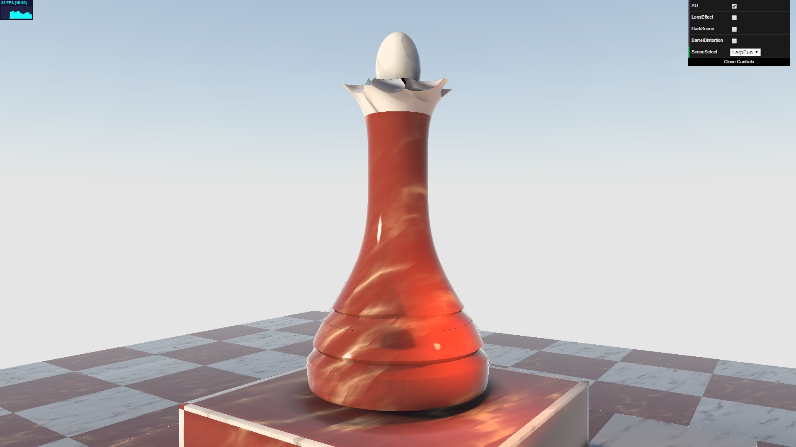
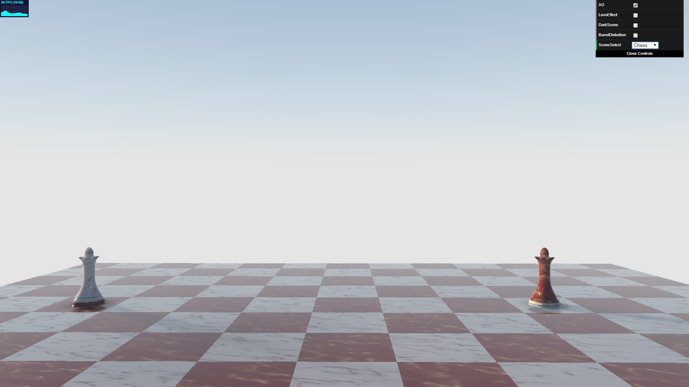

# CIS-566-Project-2 Ray marching & implicit surfaces

## Screenshots

Lerp Fun Scene | Chess Scene
-------------- | --------------
 | 

## Online Demo

- [Demo Link](https://hanmingzhang.github.io/homework-2-implicit-surfaces-HanmingZhang/)

## Features
- Lerp animation between different implicit surfaces
- Day / Night Scene
- Subsurface scattering(Most codes from [Subsurface Scattering ShaderToy](https://www.shadertoy.com/view/4dsGRl) and [Wax (fake subsurface) ShaderToy](https://www.shadertoy.com/view/lslXRj) )
- Fog
- Lens' Effect(Mostly refer to [Wax (fake subsurface) ShaderToy](https://www.shadertoy.com/view/lslXRj) )
- Barrel Camera Distortion
- Software Shadow(from [IQ's Website](http://www.iquilezles.org/www/index.htm))
- AO([IQ's Website](http://www.iquilezles.org/www/index.htm))

## Resources
- [Wax (fake subsurface) ShaderToy](https://www.shadertoy.com/view/lslXRj)

- [Subsurface Scattering ShaderToy](https://www.shadertoy.com/view/4dsGRl)

- [IQ's Website](http://www.iquilezles.org/www/index.htm)

- [Lecture slides](https://docs.google.com/presentation/d/1W5KWvkT1tscRG8x5tSfKXBRx9EGTZ-jVsOhIlfhJQLQ/edit?usp=sharing) (see the last two slides)
